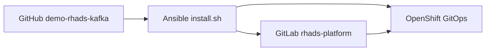
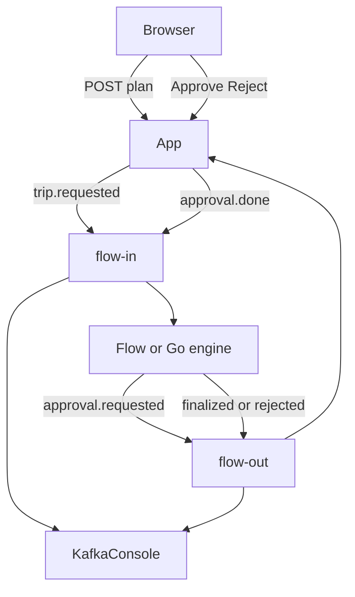

# Architecture — RHADS + Kafka agentic demo

## Goal

A repeatable platform (Ansible + OpenShift GitOps) that demonstrates **software supply chain security** (RHADS) **and** **event-driven agentic HITL** over **Streams for Apache Kafka**, with the **Kafka Console** and **Perses** dashboards.

## Source of truth

| Copy | Role |
| --- | --- |
| **GitHub** `panchoraposo/demo-rhads-kafka` (`main`) | Installer and templates for the **next** cluster. |
| Local working tree | What `./install.sh` applies, then publishes to GitLab. |
| GitLab `platform-engineers/rhads-platform` | What Argo CD reconciles **after** install (placeholders substituted). |

## Components

RHADS base (Keycloak, RHDH, Dev Spaces, GitLab, Pipelines, Nexus, Quay, RHTAS, TPA, ACS, Vault, ESO, ODF MCG) plus:

| Component | Namespace / notes |
| --- | --- |
| Streams for Apache Kafka | `kafka` — `Kafka`/`KafkaNodePool` `rhads-kafka`, topics `flow-in`/`flow-out` |
| Kafka Console | `kafka-console` — Console CR, host `kafka-console.apps.<cluster>` |
| Cluster Observability Operator | UIPlugin Monitoring + Perses; dashboards in `rhads-observability` |

Platform routes use **short hostnames** (`<component>.apps.<cluster>`), for example `quay.apps…`, `gitlab.apps…`, `rhdh.apps…`, `argocd.apps…`, `acs.apps…`, `nexus.apps…`, `vault.apps…` (not the default OpenShift `<route>-<namespace>.apps…` form).

## Software templates (catalog)

Only two scaffolder templates are registered in `catalog/templates.yaml`:

1. **quarkus-flow-kafka** — Trip planner from the [LangChain4j workshop step-04](https://quarkus.io/quarkus-workshop-langchain4j/section-3/step-04/) pattern: Quarkus Flow (community) + Kafka CloudEvents + MaaS.
2. **go-flow-kafka** — Same API and CloudEvents types; hand-rolled Kafka workflow engine; community Go modules for RHDA/TPA/ACS CVEs.

## CI / supply chain

Unchanged from demo-rhads: Tekton build/promote, Syft SBOM to TPA, cosign + Rekor, ACS, Conforma STRICT on tag/release, Tekton Chains. Dependencies resolve through **Nexus** (`maven-public`, `npm-group`, `go-group`). Go apps use `build.language: go`: Tekton `rhads-build-source` runs `go mod tidy` + `go mod vendor` via Nexus, then the image build compiles with `-mod=vendor` (offline). The default Go image is **community** (`golang` + `debian`); `Dockerfile.ubi` swaps to Red Hat UBI for an ACS CVE contrast.

## Secrets

MaaS credentials for both templates: Vault `secret/apps/{app}` via ExternalSecret in app namespaces. Kafka bootstrap defaults to `rhads-kafka-kafka-bootstrap.kafka.svc:9092` (internal plain listener for the demo).
